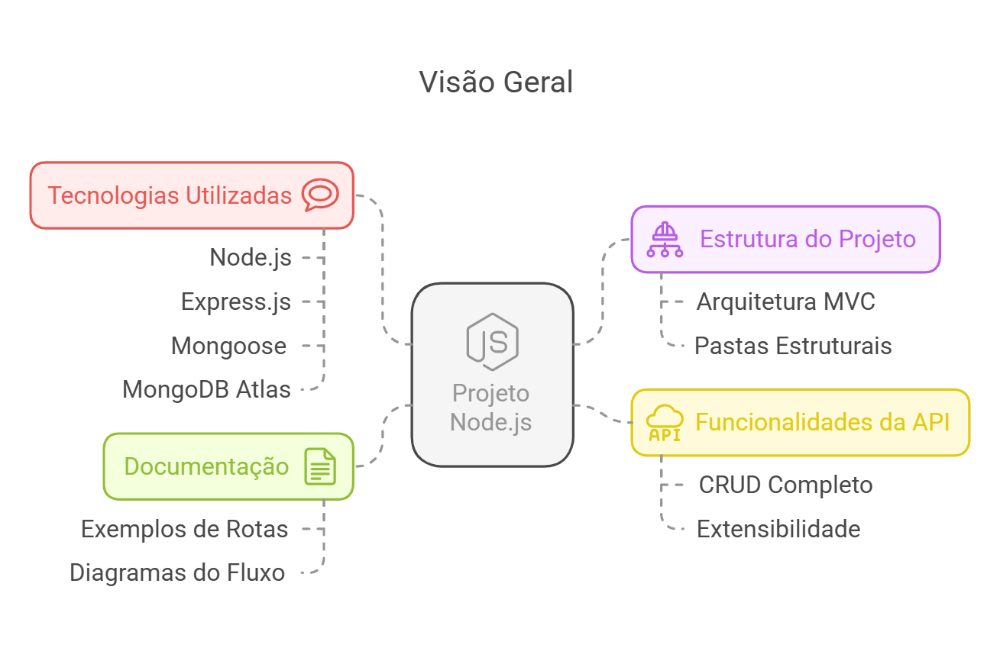
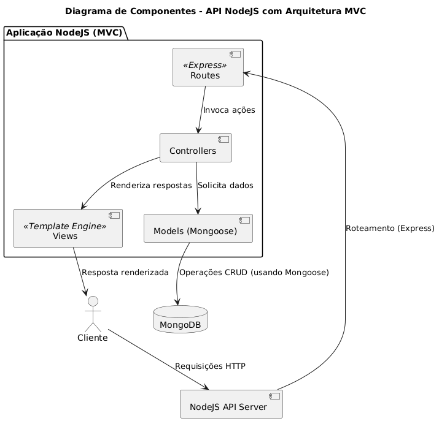
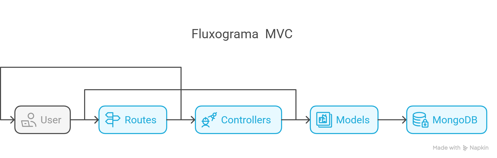
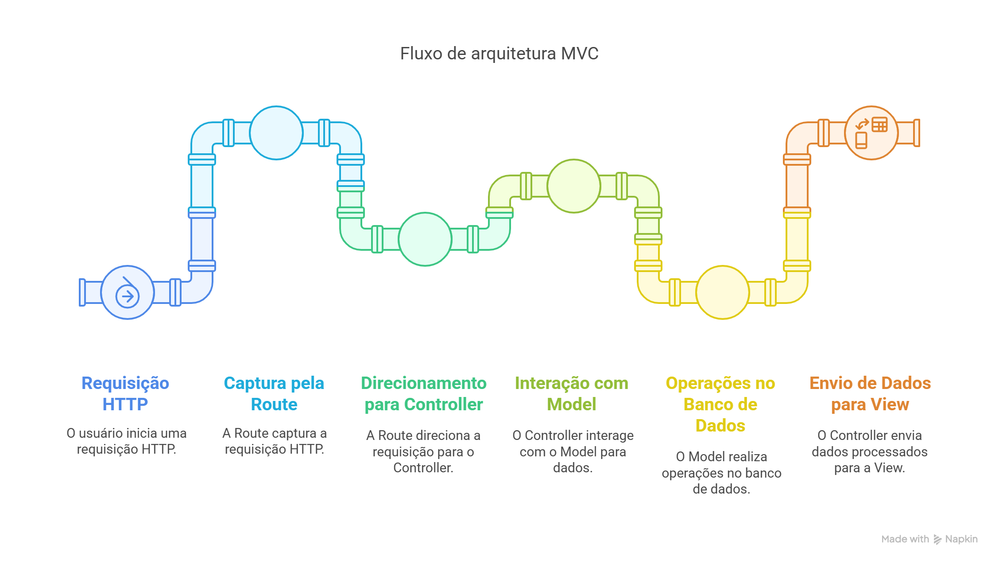
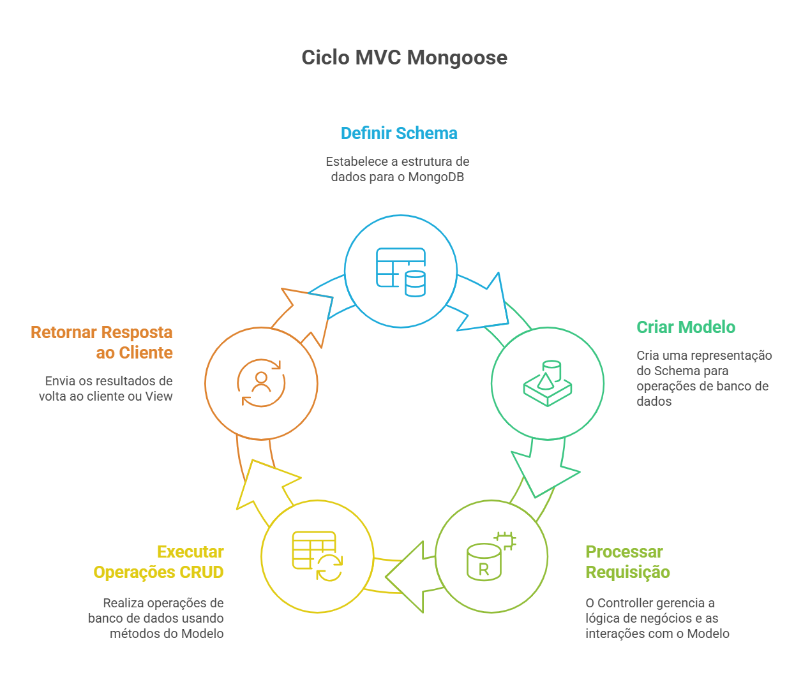
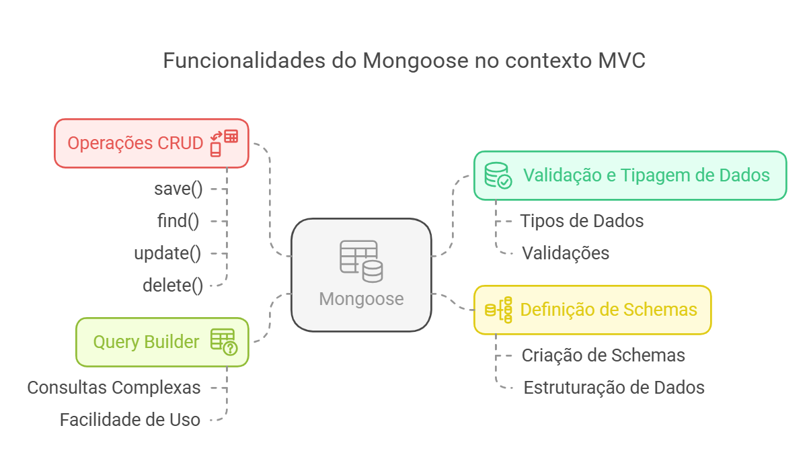
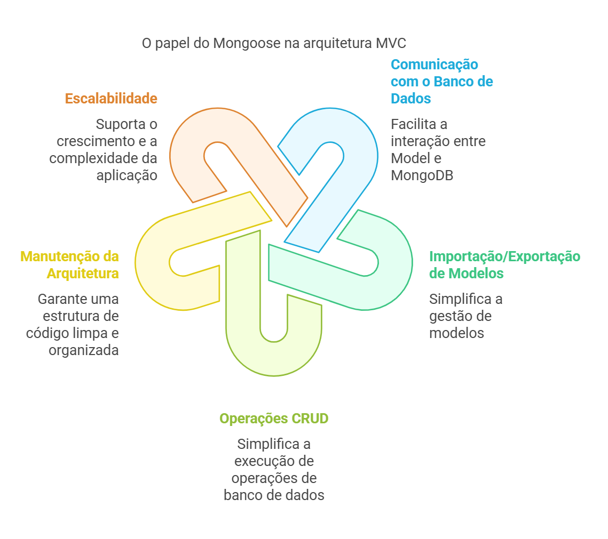

# **Backend Node.js**

Este projeto é um backend desenvolvido em Node.js utilizando o framework Express.js. Ele implementa uma arquitetura MVC (Model-View-Controller) para organizar o código e facilitar a manutenção. A aplicação oferece um CRUD completo para gerenciar produtos, com integração ao banco de dados MongoDB Atlas por meio do Mongoose. Além disso, possui suporte para manipulação de arquivos, testes automatizados com Newman/Postman, documentação disponível em Swagger e extensibilidade para novas funcionalidades.

## **Principais Funcionalidades**
- **CRUD de Produtos**: Endpoints para criar, listar, atualizar e deletar produtos.
- **Integração com MongoDB**: Utilização do Mongoose para definição de schemas e operações no banco de dados.
- **Manipulação de Arquivos**: Rota para buscar e registrar arquivos no sistema.
- **Documentação da API**: Documentação gerada com Swagger para facilitar o uso e entendimento dos endpoints.
- **Extensibilidade**: Estrutura modular que permite adicionar novas funcionalidades sem grandes alterações no código.

 

# **Índice**

| **Aspecto**                | **Descrição Atualizada**                                                                                |
| -------------------------- | ------------------------------------------------------------------------------------------------------- |
| **Sistema Operacional**    | Windows 10                                                                                              |
| **Versão Node.js**         | v22.11.0                                                                                                |
| **Framework Utilizado**    | Express.js                                                                                              |
| **Banco de Dados**         | MongoDB Atlas                                                                                           |
| **Arquitetura**            | MVC (Model-View-Controller)                                                                             |
| **Middleware**             | Express.json()                                                                                          |
| **Funcionalidades da API** | CRUD completo (GET, POST, PUT, DELETE) com extensibilidade para buscar arquivos no sistema operacional. |
| **Bibliotecas Usadas**     | Mongoose para integração com MongoDB, `fs` para operações de arquivos locais.                           |
| **Documentação**           | Inclui exemplos detalhados de rotas, respostas e diagramas do fluxo MVC.                                |

Para manter a compatibilidade com o código após atualizar o Node.js, os principais cuidados foram:

| **Seção**                       | **Descrição**                                                                                                                                                                                   |
| ------------------------------- | ----------------------------------------------------------------------------------------------------------------------------------------------------------------------------------------------- |
| **Tecnologias Usadas**          | Node.js, Express, Mongoose, MongoDB Atlas, Postman, Newman.                                      |
| **Estrutura do Projeto**        | Arquitetura baseada em MVC com pastas: `src/config`, `src/models`, `src/controllers`, `src/routes`.                                                                                             |
| **Banco de Dados**              | Utiliza o MongoDB Atlas. Schemas definidos para produtos (`productSchema`) e arquivos (`fileSchema`) com uso do Mongoose.                                                                       |
| **Rotas Configuradas**          | - `GET /products`: Lista todos os produtos.  - `POST /products`: Cria um novo produto.  - `DELETE /products/:id`: Deleta produto pelo ID.  - `PUT /products/:id`: Atualiza um produto. |
| **Extensões Adicionais**        | Rota para buscar e registrar arquivos no banco:  - `GET /files?path=<diretório>`: Busca arquivos permitidos em um diretório e os salva no MongoDB.                                           |
| **Documentação API**            | Criada para cada endpoint, incluindo exemplo de requisição, parâmetros esperados e resposta no formato JSON.                                                                                    |
| **Logs**                        | Configurados para depuração e rastreamento, exibindo detalhes de erros no terminal e no console do cliente.                                                                                     |
| **Ambiente de Desenvolvimento** | Testado no Node.js `v20.15.0` com inicialização `npm init es6 -y`.                                                                                                                              |
| **Extensibilidade**             | O sistema é modular e preparado para inclusão de novos endpoints ou esquemas sem alterações drásticas.                                                                                          |
| **Fluxo de Trabalho**           | Cada camada (Model, Controller e Route) interage de forma clara e desacoplada, permitindo fácil manutenção e escalabilidade.                                                                    |

## Arquitetura MVC

A aplicação usa a arquitetura MVC (Model-View-Controller) e separa em quatro componentes principais (responsabilidades):

1. **Model**: Representa a lógica de dados da aplicação. Ele gerencia a lógica de negócios e as regras de dados, além de interagir com o banco de dados para recuperar, salvar e atualizar informações.
2. **View**: É responsável pela apresentação dos dados. A View exibe a interface do usuário e apresenta os dados do Model de uma forma que seja compreensível e interativa para o usuário.
3. **Controller**: Atua como um intermediário entre o Model e a View. Ele recebe as entradas do usuário através da View , processa essas entradas (possivelmente alterando o estado do Model) e retorna a saída apropriada para a View.
4. **Route**: Embora não seja uma parte tradicional do padrão MVC, as rotas são frequentemente usadas em frameworks modernos para mapear URLs para ações específicas nos Controllers. As rotas ajudam a definir como as requisições HTTP são direcionadas para os métodos apropriados nos Controllers.

Essa abordagem facilita a manutenção e a escalabilidade da aplicação, permitindo que diferentes partes da equipe de desenvolvimento trabalhem simultaneamente em diferentes componentes sem causar conflitos.

Além disso, torna o código mais organizado e modular, o que é uma grande vantagem em projetos de grande escala.

O uso de **Route** no MVC define como as requisições são mapeadas para as ações no **Controller:**

### Fluxo:

- **Requisição HTTP**: O usuário faz uma requisição HTTP que é capturada pela Route.
- **Processamento da Requisição**: A Route direciona a requisição para o Controller.
- **Interação com o Model**: O Controller processa a requisição e interage com o Model para obter ou modificar dados.
- **Banco de Dados**: O Model realiza operações no banco de dados conforme necessário.
- **Renderização de Dados**: O Controller envia os dados processados para a View.
- **Resposta ao Usuário**: A View apresenta a resposta ao usuário.

As rotas são configuradas para permitir que o usuário interaja com a aplicação, chamando ações específicas no **Controller** e manipulando dados por meio do **Model**, enquanto a **View** exibe os resultados.

Essa abordagem facilita a organização e a escalabilidade da aplicação, pois separa claramente a lógica de roteamento (**Route**), processamento de dados (**Controller**), manipulação de dados (**Model**) e exibição (**View**).

### Mongoose no contexto MVC

A lógica do **Mongoose** facilita a **importação e exportação de modelos (Schemas)**, sendo uma ferramenta poderosa para trabalhar com bancos de dados no MongoDB na aplicação Node.js.

- **Model** (Mongoose): Facilita a definição de **Schemas** (estruturas de dados) e a criação de **Modelos** para interagir com o banco de dados MongoDB.
  - **Schemas**: Define a estrutura dos documentos que serão armazenados no MongoDB. Ele define tipos de dados, validações e outros comportamentos.
  - **Modelo**: A partir de um **Schema**, o **Model** é criado. O **Model** é uma representação de uma coleção no banco de dados e contém métodos que permitem criar, ler, atualizar e deletar documentos dessa coleção.
- **Controller**: Recebe uma requisição do **Route** e, usando o **Model** do Mongoose, executa a lógica de negócios. Na camada de **Controller**, o **Model** é importado para interagir com os dados para receber e usar os métodos do **Model** (Shemas) para fazer as operações de CRUD no banco de dados e retornar uma resposta para o **Client** (a **View**).

### Importação exportação de modelos

O **Mongoose** facilita a interação entre o **Controller** e o **Model**, tornando a camada de **Model** mais robusta, simplificada e permite:

- **Validação e tipagem de dados**: Definir os tipos de dados e validações para garantir que os dados inseridos no banco sejam válidos.
- **Operações CRUD**: O **Mongoose** oferece métodos como `save()`, `find()`, `update()`, `delete()` que facilitam a manipulação de dados.
- **Definição de Schemas**: Criação de **Schemas** que estruturam os dados antes de serem armazenados no banco de dados.
- **Query Builder**: O Mongoose facilita a construção de consultas complexas de forma mais intuitiva.

### Conclusão

O **Mongoose** é um excelente módulo que facilita a comunicação entre a camada **Model** e o banco de dados **MongoDB**, além de simplificar a importação e exportação de modelos e a execução de operações CRUD. A integração do Mongoose dentro do padrão **MVC** ajuda a manter a arquitetura limpa, organizada e eficiente, garantindo que a aplicação seja fácil de escalar e de manter.

### Funcionalidades Ativas e Extensibilidades

| Funcionalidade Ativa       | Dependência                           | Finalidade                                                                     |
| -------------------------- | ------------------------------------- | ------------------------------------------------------------------------------ |
| Servidor Express           | `express`                             | Criação de um servidor web para gerenciar rotas e middleware.                  |
| Autenticação e Autorização | `bcryptjs`, `jsonwebtoken`, `jose`    | Gerenciamento de autenticação de usuários e geração de tokens JWT.             |
| Manipulação de Arquivos    | `multer`                              | Upload e manipulação de arquivos.                                              |
| Conexão com Banco de Dados | `mongodb`, `mongoose`                 | Conexão e manipulação de dados no banco de dados MongoDB.                      |
| Configuração de Ambiente   | `dotenv`                              | Gerenciamento de variáveis de ambiente.                                        |
| Validação de Dados         | `har-validator`                       | Validação de dados HTTP.                                                       |
| Testes Automatizados       | `newman`                              | Execução de testes automatizados com Postman.                                  |
| Documentação da API        | `swagger-jsdoc`, `swagger-ui-express` | Geração e exibição de documentação da API.                                     |
| Utilitários                | `uuid`, `glob`, `mkdirp`              | Geração de UUIDs, manipulação de caminhos de arquivos e criação de diretórios. |

| Possível Extensibilidade | Dependência                  | Finalidade                                                                 |
| ------------------------ | ---------------------------- | -------------------------------------------------------------------------- |
| Autenticação com OAuth   | `passport`, `passport-oauth` | Adicionar suporte para autenticação via OAuth (Google, Facebook, etc.).    |
| Cache de Dados           | `redis`                      | Implementar cache de dados para melhorar a performance.                    |
| Monitoramento e Logging  | `winston`, `morgan`          | Adicionar funcionalidades de logging e monitoramento de requisições.       |
| Rate Limiting            | `express-rate-limit`         | Implementar limitação de taxa de requisições para prevenir abusos.         |
| GraphQL                  | `apollo-server-express`      | Adicionar suporte para GraphQL como alternativa ao REST.                   |
| Mensageria               | `amqplib`                    | Implementar filas de mensagens com RabbitMQ para processamento assíncrono. |

## Licença

Este projeto está licenciado sob a **Creative Commons Attribution-NonCommercial-ShareAlike 4.0 International (CC BY-NC-SA 4.0)**.

### Direitos concedidos:

- Qualquer pessoa pode **usar, modificar e compartilhar o código**.
- **Uso comercial proibido** sem autorização.
- Modificações devem ser distribuídas sob os mesmos termos da licença original.

Para mais detalhes, consulte o arquivo `LICENSE.md` ou acesse [Creative Commons CC BY-NC-SA 4.0](https://creativecommons.org/licenses/by-nc-sa/4.0/).